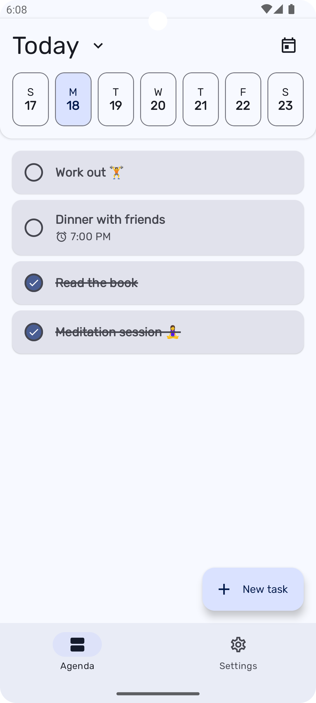
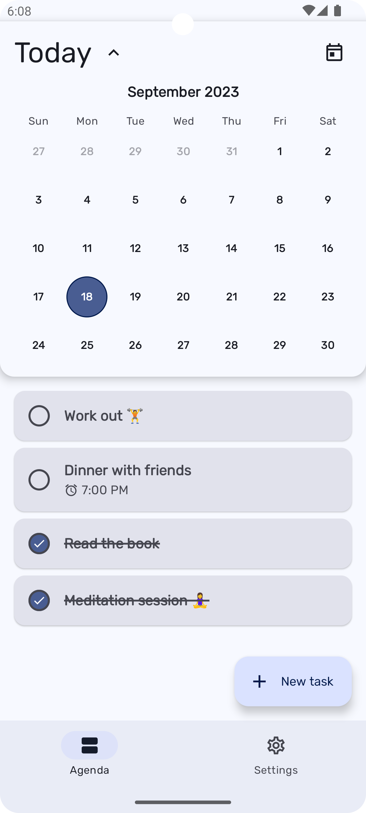
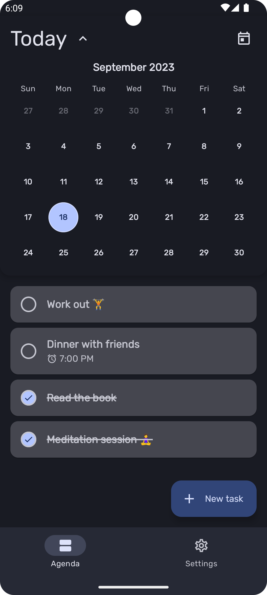
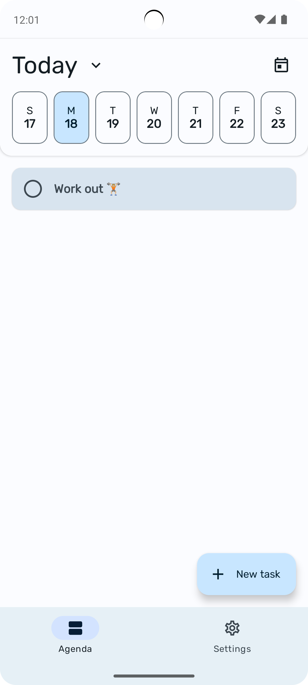
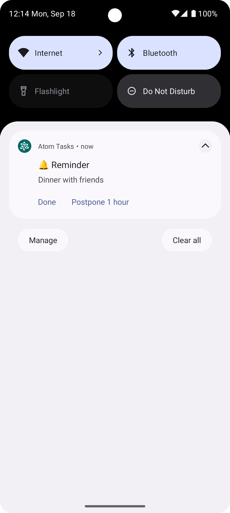

# ⚛️ Atom Tasks

|  |  |  |  |  |
|-----------------------------|-----------------------------------------------|-----------------------------------|------------------------------------|-----------------------------------------|

_Atom tasks_ is an Android Application to create and organise your tasks.

## Download

## Development info

* 100% Kotlin
* 100% Jetpack Compose
* Kotlin Coroutines
* Hilt for dependency injection
* Room persistance library
* Detekt
* [Compose Destinations](https://github.com/raamcosta/compose-destinations) on top of Jetpack Compose Navigation
* MVI pattern design with `StateFlow`

###  Extras you might be interested in

* This application tries to follow Clean Code & SOLID principles.
* Atom tasks's code tries to write tests as much as possible in order to get a robust code.
    * Not only unit tests, you will find also functional and snapshot tests
* Even it is a production-ready application the objective of this project is to use the cutting-edge libraries and technologies.

## Contributing

You're more than welcome to contribute to this project and it will be appreciated.

Just keep in mind that not everything would match with the application's goals so make sure you ask before putting effort on any feature.
